To use Facebook Channel, you have to create a Facebook app in the developer portal. You can find more details about creating Facebook apps [here](https://developers.facebook.com/docs/apps/#register).


### Prerequisites

1. A valid facebook account.
2. A valid facebook page.


### Register A Facebook App

1. Go to [Facebook developer portal](https://developers.facebook.com/apps/) and click on the "Create App" button

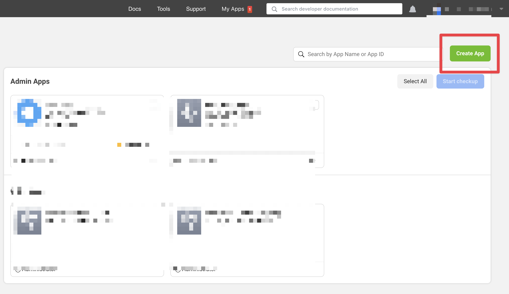

2. Select the option "Other".


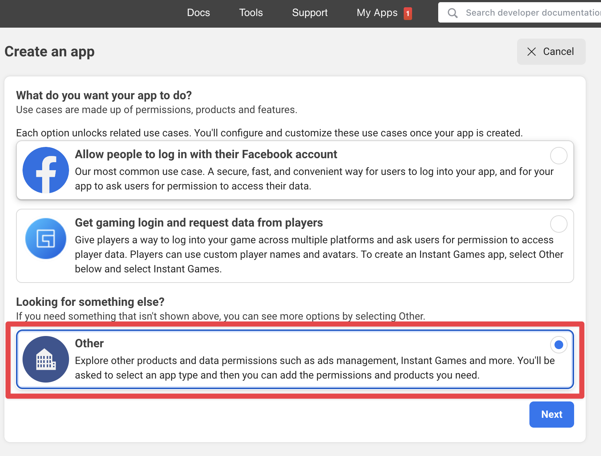

3. For the app type, choose "Business".

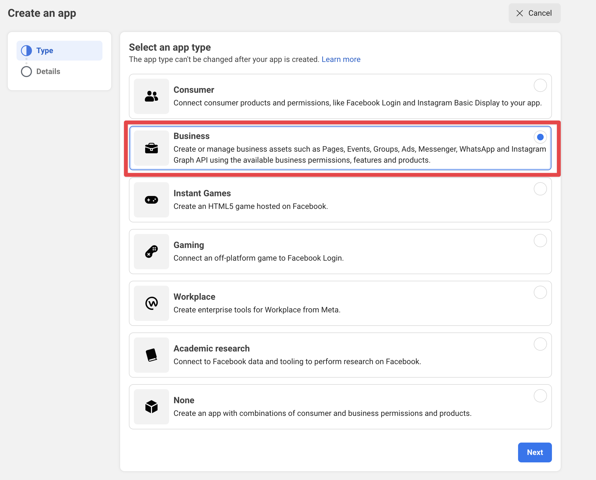

3. Enter basic details like the app name and email.

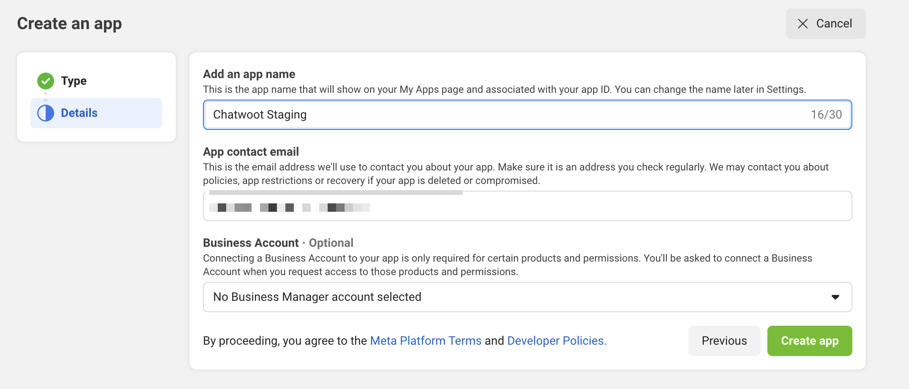

Once you register your Facebook App, you will have to obtain the `App Id` and `App Secret`. These values will be available in the app settings and will be required while setting up Chatwoot environment variables.


### Configuring the Environment Variables in Chatwoot

Configure the following Chatwoot environment variables with the values you obtained during the Facebook app setup. The `FB_VERIFY_TOKEN` should be a unique and secure string that you provide when configuring the Facebook app. Generate a random string and set it as the `FB_VERIFY_TOKEN`. Facebook will include this string in all verification requests.

Restart the Chatwoot server after updating the environment variables

```bash
FB_VERIFY_TOKEN=
FB_APP_SECRET=
FB_APP_ID=
```

### Configure Facebook Login


1. Add the Facebook Login product via the Facebook app dashboard.

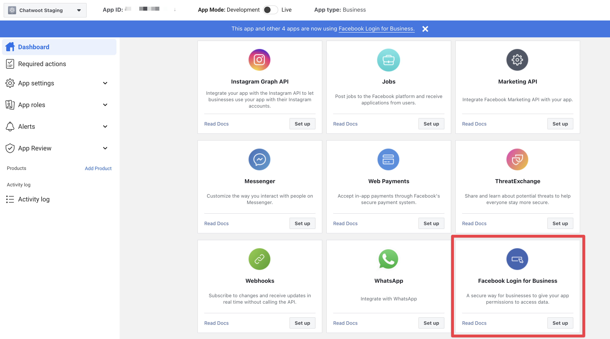


2. Enable `Web OAuth Login`, `Login with Javascript SDK` and add your self-hosted domain to the `Allowed Domains for the JavaScript SDK` input.

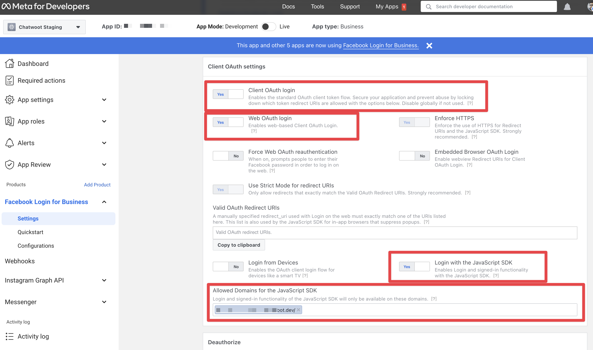

### Configure the Facebook App

1. In the app settings, add your `Chatwoot installation domain` as your app domain.

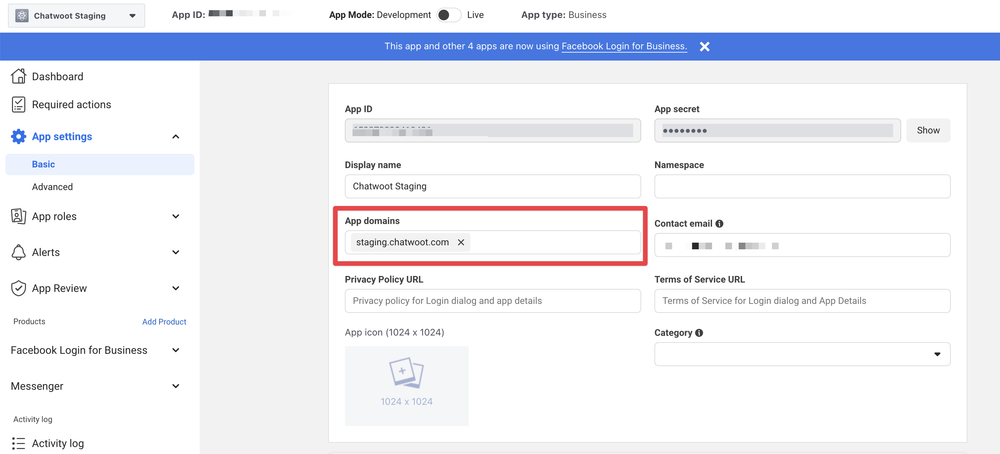

2. In the products section in your app settings page, Add "Messenger"

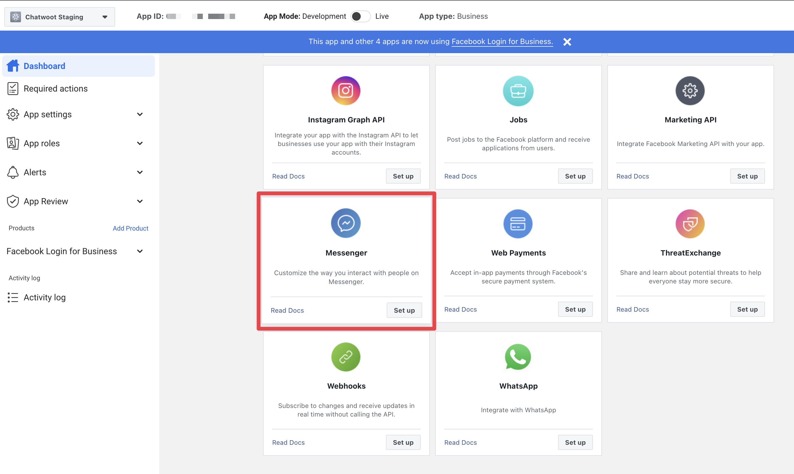

3. Go to the Messenger settings and configure the call back URL


4. Provide the Callback URL as `{your_chatwoot_installation_url}/bot` and the Verify token as `FB_VERIFY_TOKEN` from your environment variable.


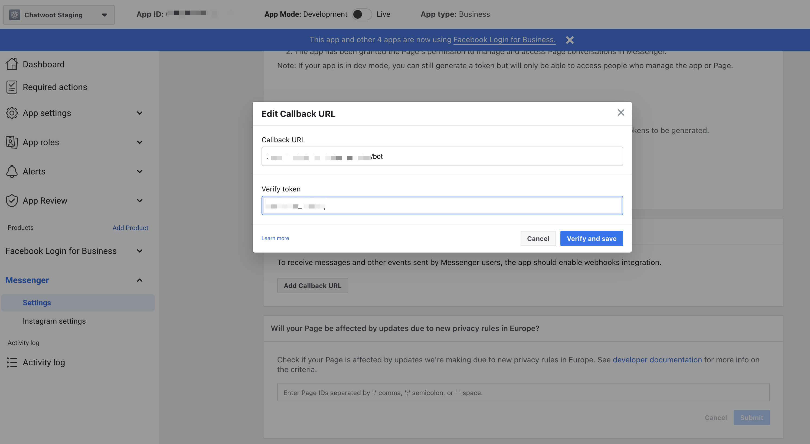

5. Head over to Chatwoot and create a Messenger inbox. Choose a page for which your Facebook developer account has admin access to. Please refer to this [guide](https://www.chatwoot.com/hc/user-guide/articles/1677778588-how-to-setup-a-facebook-channel) for more details on creating a Messenger inbox in Chatwoot.


### Testing the Facebook channel

Until the application is approved for production, Facebook wouldn't send the new messages on your page to Chatwoot.

To test the changes until the app is approved for production. Follow the steps

1. Head over to the messenger section in your app settings page, in Facebook developers.


2. Click `Add or remove pages` and connect the page which you choose while creating the Chatwoot Messenger inbox.

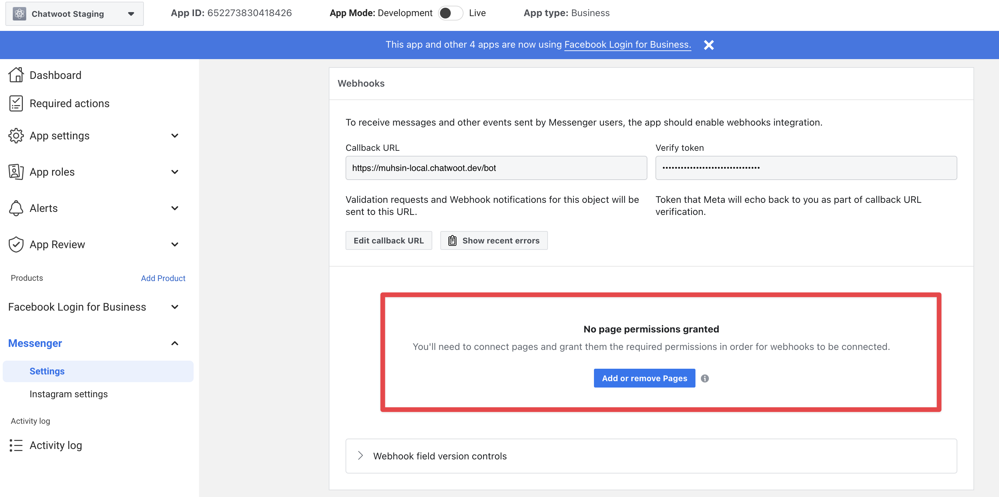


3. After connecting the pages, Click on `Add subscriptions` from the connected page.

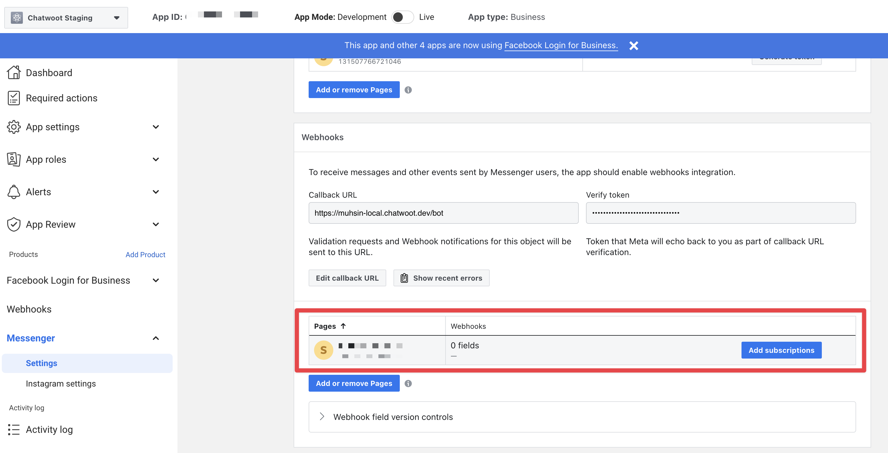

4. Subscribe to the following fields and save the subscription.
```
messages
messaging_postbacks
message_deliveries
message_reads
message_echoes
```


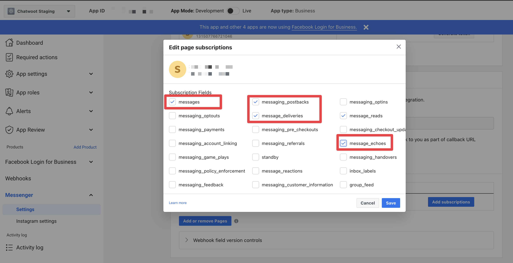

4. Send a message to the connected page from your Facebook account and it should appear in Chatwoot now.

### Going into production.

Before you can start using your Facebook app in production, you will have to get it verified by Facebook. Refer to the [docs](https://developers.facebook.com/docs/apps/review/) on getting your app verified.

Obtain advanced access to the required permissions mentioned below for your Facebook app
```
pages_messaging (To message on behalf of the page)
pages_show_list (To list the pages to be connected in chatwoot)
pages_manage_metadata (Subscribe webhooks on behalf of the page)
business_management
pages_read_engagement (  Read followers data (including name, PSID), and profile )
Business Asset User Profile Access  (For accessing user profile picture and name of people who contacts the page)
```

Make sure your facebook app subscription version is 17.0, we have updated the FB subscription with the latest version, so change the permission subscription version under the facebook app webhooks option.

### Developing or Testing Facebook Integration in your machine

Install [ngrok](https://ngrok.com/docs) on your machine. This will be required since Facebook Messenger API's will only communicate via https.

```bash
brew cask install ngrok
```

Configure ngrok to route to your Rails server port.

```bash
ngrok http 3000
```

Go to the Facebook developers page and navigate into your app settings. In the app settings, add `localhost` as your app domain.
In the Messenger settings page, configure the callback url with the following value.

```bash
{your_ngrok_url}/bot
```

Update verify token in your Chatwoot environment variables.

You will also have to add a Facebook page to your `Access Tokens` section in your Messenger settings page.
Restart the Chatwoot local server. Your Chatwoot setup will be ready to receive Facebook messages.

### Facebook API version

We support facebook API version v13.0 going forward, which you can update in the facebook app advanced settings.


### Test your local Setup

1. After finishing the set-up above, [create a Facebook inbox](https://www.chatwoot.com/hc/user-guide/articles/1677778588-how-to-setup-a-facebook-channel) after logging in to your Chatwoot Installation.
2. Send a message to your page from Facebook.
3. Wait and confirm incoming requests to `/bot` endpoint in your ngrok screen.
